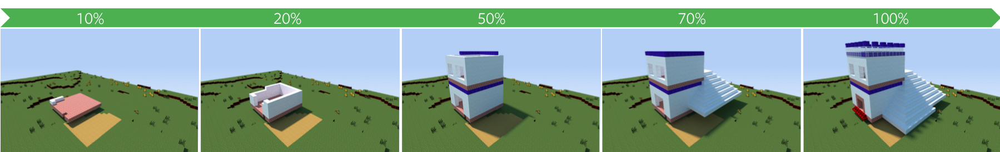

# VoxelCNN

[VoxelCNN](http://openaccess.thecvf.com/content_ICCV_2019/papers/Chen_Order-Aware_Generative_Modeling_Using_the_3D-Craft_Dataset_ICCV_2019_paper.pdf) is an order-aware generative model for building houses in Minecraft. This codebase is a [PyTorch](https://pytorch.org/) implementation of the training and evaluation pipeline for VoxelCNN.


VoxelCNN is trained and evaluated with the [*3D-Craft*](https://craftassist.s3-us-west-2.amazonaws.com/pubr/house_data.tar.gz) dataset.


For more details, please refer to the ICCV 19' paper [*Order-Aware Generative Modeling Using the 3D-Craft Dataset*](http://openaccess.thecvf.com/content_ICCV_2019/papers/Chen_Order-Aware_Generative_Modeling_Using_the_3D-Craft_Dataset_ICCV_2019_paper.pdf).

## Installation

Python version >= 3.7 is required.

### 0. Clone the repo

```
git clone https://github.com/facebookresearch/VoxelCNN
cd VoxelCNN
```

### 1. (Optional) Create a virtual environment

```
pip install virtualenv
virtualenv voxelcnn_venv
source voxelcnn_venv/bin/activate
```

### 2. Install PyTorch

Please follow the official [installation guide](https://pytorch.org/get-started/locally/) to install PyTorch version >= 1.3.

### 3. Install other dependencies

```
pip install numpy requests tqdm
```

### 4. (Optional) Verify installation by running unit tests

```
python -m unittest discover -s test -v
```

## Training and Evaluation

The [*3D-Craft*](https://craftassist.s3-us-west-2.amazonaws.com/pubr/house_data.tar.gz) dataset will be downloaded automatically when launching the training for the first time.

Run the fast training (fewer epochs, slightly worse results):
```
python main.py --num_epochs 3 --step_size 1 --save_dir /path/to/save/log/and/checkpoints
```

Example final test results for the fast training:
```
acc@1: 0.622  acc@5: 0.760  acc@10: 0.788
cca_10%: 13.374  cca_25%: 11.115  cca_50%: 12.546  cca_75%: 12.564  cca_90%: 7.632  cca_avg: 11.446
mtc: 131.411  mtc_normed: 0.241
```

Run the full training:
```
python main.py --save_dir /path/to/save/log/and/checkpoints
```

Example final test results for the full training:
```
acc@1: 0.640  acc@5: 0.778  acc@10: 0.806
cca_10%: 13.630  cca_25%: 12.223  cca_50%: 13.168  cca_75%: 13.047  cca_90%: 7.571  cca_avg: 11.928
mtc: 121.753  mtc_normed: 0.223
```

## License

VoxelCNN is released under the [CC-BY-NC 4.0 license](LICENSE).

## Citing

```
@inproceedings{zchen2019,
  title = {Order-Aware Generative Modeling Using the 3D-Craft Dataset},
  author = {Chen, Zhuoyuan and Guo, Demi and Xiao, Tong and Xie, Saining and Chen, Xinlei and Yu, Haonan and Gray, Jonathan and Srinet, Kavya and Fan, Haoqi and Ma, Jerry and Qi, Charles R and Tulsiani, Shubham and Szlam, Arthur and Zitnick, C. Lawrence},
  booktitle = {ICCV},
  year = {2019},
}
```
